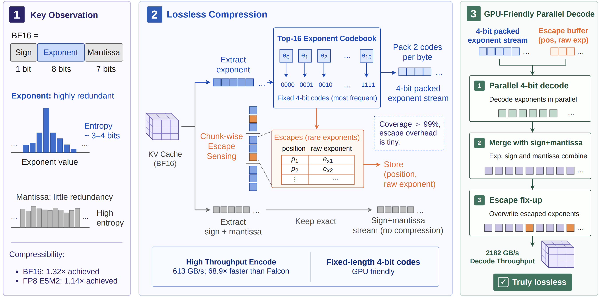

<div align="center">

# SplitZip: Ultra-Fast Lossless KV Compression for Disaggregated LLM Serving

<p>
  <a href="https://arxiv.org/abs/2605.01708">
    
  </a>
  <a href="https://github.com/Intelligent-Microsystems-Lab/SplitZip">
    
  </a>
  <a href="LICENSE">
    
  </a>
</p>

<p>
  <a href="https://scholar.google.com/citations?user=wed16nIAAAAJ&hl=zh-TW">Yipin Guo</a>,
  <a href="https://siddharth-joshi.com/">Siddharth Joshi</a>
</p>

</div>

---

## News

- **2026-06-05:** This repository is released.

---

## Abstract

SplitZip is a GPU-friendly lossless compressor for KV cache transfer in
prefill-decode disaggregated LLM serving. It preserves BF16 KV tensors bitwise
while reducing transfer volume and keeping both compression and decompression
on the latency-critical GPU path.

The key observation is that BF16 KV activations have highly redundant exponent
values. SplitZip encodes the most frequent exponent values with fixed 4-bit
codes, keeps sign and mantissa bits exact, and routes rare exponent values
through a sparse escape stream. The released artifact includes the public
Triton codec and reproduction scripts for the BF16 exponent analysis and codec
throughput measurements used in the paper.

<p align="center">
  
</p>

## Highlights

- Lossless BF16 KV cache compression with bitwise round-trip recovery.
- Offline-calibrated, Top-16 exponent codebooks with chunk-local sparse escape metadata.
- GPU encode and decode kernels implemented in Triton.
- Reproduction scripts for WikiText-2/Qwen3-32B exponent statistics and codec-path throughput.
- Paper-reported codec-only throughput on real BF16 KV activations: 613.3 GB/s encode and 2181.8 GB/s decode.
- Exercised in an out-of-tree SGLang disaggregated-serving path using Mooncake for KV-cache transfer. 

---

## Installation

SplitZip requires a CUDA-capable GPU and a PyTorch/Triton stack compatible with
that GPU. The public scripts were testing with Python 3.12 and the dependencies outlined in `requirements.txt`.

```bash
conda create -n splitzip python=3.12 -y
conda activate splitzip
pip install -r requirements.txt
```

If you already maintain a PyTorch CUDA environment, install the packages from
`requirements.txt` there instead of creating a new environment.

## Codec API

```python
import torch

from codec_gpu import ChunkLocalSplitZipGPU

x = torch.randn(1024, 4096, dtype=torch.bfloat16, device="cuda")

codec = ChunkLocalSplitZipGPU(device="cuda", chunk_size=1024)
coverage = codec.calibrate(x)

encoded = codec.encode(x)
decoded = codec.decode(encoded)

assert torch.equal(x.view(torch.int16), decoded.view(torch.int16))
print(coverage, encoded.compressed_bytes)
```
The current public codec API is stateful. The encoded objects are intended to be decoded with the same calibrated codec state. For paper-style experiments, calibrate the codebook on a separate calibration set rather than on the benchmark tensor itself.

## Quick Start

Run a small codec smoke test with synthetic BF16 data:

```bash
python bench_codec_throughput.py \
  --device cuda:0 \
  --synthetic \
  --calibrate-on-input \
  --rows 1024 \
  --hidden-dim 4096 \
  --warmup 3 \
  --iters 10 \
  --repeats 2 \
  --output splitzip_smoke.json
```

The benchmark verifies bitwise lossless recovery before reporting compression
ratio and encode/decode throughput.

## Release Scope
This initial release includes:
- Standalone Triton encode/decode kernels for BF16 CUDA tensors.
- A stateful calibrated codec API for bitwise BF16 round-trip recovery.
- BF16 exponent-statistics analysis for Qwen3-32B/WikiText-2 style runs.
- Codec-path throughput benchmarking.

## Reproducing Paper Artifact Scripts

The paper protocol uses WikiText-2 with Qwen3-32B:

- codebook calibration: `wikitext/wikitext-2-raw-v1:train`;
- entropy/statistics evaluation: `wikitext/wikitext-2-raw-v1:test`;
- codec throughput tensor source: `wikitext/wikitext-2-raw-v1:test`.

Analyze BF16 KV exponent entropy:

```bash
python analyze_bf16_exponent_entropy_qwen32.py \
  --model Qwen/Qwen3-32B \
  --device-map auto \
  --max-prompts 4 \
  --output qwen3_32b_bf16_exponent_entropy.json
```

Run the public codec throughput benchmark:

```bash
python bench_codec_throughput.py \
  --device cuda:0 \
  --rows 65536 \
  --hidden-dim 4096 \
  --chunk-size 1024 \
  --warmup 10 \
  --iters 50 \
  --repeats 5 \
  --output splitzip_codec_throughput.json
```

For offline reproduction from saved BF16 tensors:

```bash
python bench_codec_throughput.py \
  --device cuda:0 \
  --input kv_tensor.pt \
  --calibration-input qwen32_wikitext2_train_kv.pt \
  --chunk-size 1024 \
  --output splitzip_codec_throughput.json
```

Use `--synthetic` and `--calibrate-on-input` only for kernel sanity checks; they
are not the paper protocol.

---

## Integration Status
SplitZip has been exercised in an out-of-tree SGLang disaggregated-serving path using Mooncake for KV-cache transfer. This repository currently releases the
  standalone Triton codec, BF16 exponent-analysis script, and codec-throughput benchmark.

  The SGLang/Mooncake integration code is not included in this initial public release. We plan to document, publish, or upstream that integration path separately.


## Repository Contents

- `codec_gpu.py`: public ChunkLocalSplitZipGPU Triton codec.
- `bench_codec_throughput.py`: encode/decode throughput benchmark for the public
  codec API.
- `analyze_bf16_exponent_entropy_qwen32.py`: BF16 KV exponent entropy and
  Top-16 coverage analysis.
- `requirements.txt`: minimal Python runtime dependencies.

## Roadmap

- Publish, or upstream the out-of-tree SGLang/Mooncake KV-transfer integration.
- Add integration-facing codebook/payload metadata for portable transfer boundaries.
- Add CI after the initial artifact release.

## Citation

If you find SplitZip useful in your research, please cite:

```bibtex
@misc{guo2026splitzipultrafastlossless,
      title={SplitZip: Ultra Fast Lossless KV Compression for Disaggregated LLM Serving}, 
      author={Yipin Guo and Siddharth Joshi},
      year={2026},
      eprint={2605.01708},
      archivePrefix={arXiv},
      primaryClass={cs.DC},
      url={https://arxiv.org/abs/2605.01708}, 
}
```

## License

This project is released under the MIT License. See `LICENSE` for details.
